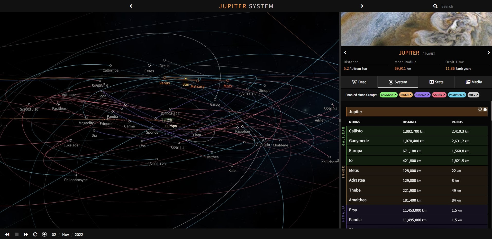

# The Orrery



This is a personal web project, inspired by the existing [Solar System simulation](http://sanderblue.github.io/solar-system-threejs/) by [sanderblue](https://github.com/sanderblue).

The project itself uses a data dump from the [Solaire API](https://api.le-systeme-solaire.net/en/) to generate the positions all the planets and moons in the Solar System.
These are rendered to a `<canvas>` using ThreeJS. Some parsing is done to the data in the front-end to generate the planet names and IDs in English.

Vite is utilised for the front-end build process, and Vue2 is leveraged to render the UI elements.

The Orrery currently lists **231 celestial entities** in the Solar System, including:

- 1 Sun
- 8 Planets
- 216 Moons
- 6 Dwarf Planets

Clicking on an entity will retrieve Wikipedia information via the [Wikipedia API](https://www.mediawiki.org/wiki/API:Main_page), and NASA information via the [NASA images API](https://images.nasa.gov/).

## Running the project

```bash
  git clone https://github.com/Jollus174/threejs-planet-system.git
```

Go to the project directory

```bash
  cd src
```

Install dependencies

```bash
  npm install
```

Start the server

```bash
  npm run dev
```

## Building the project

```bash
  npm run build
```
